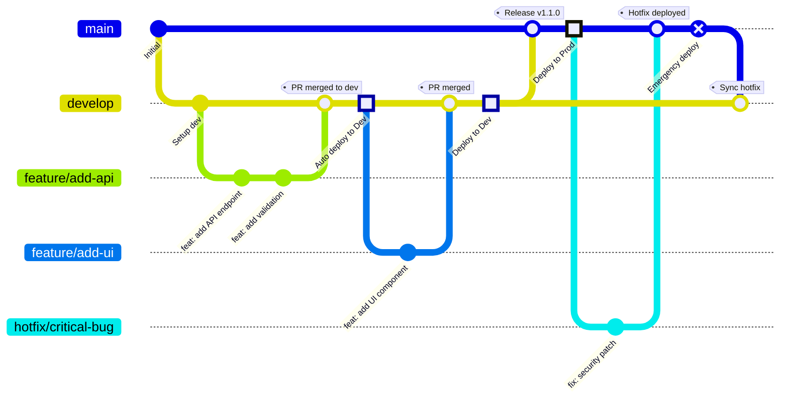
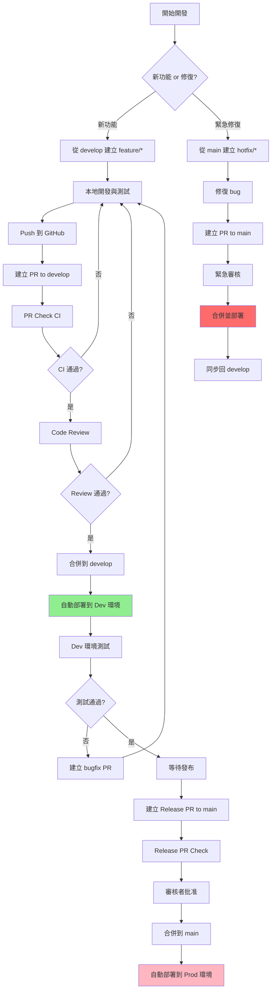
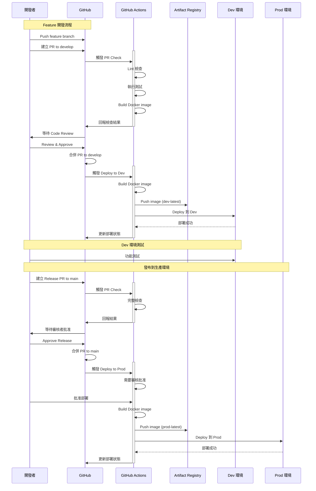
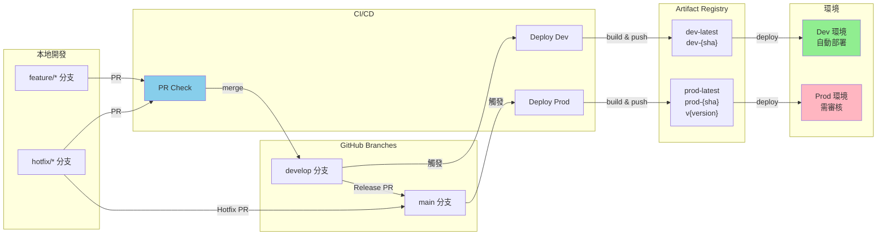
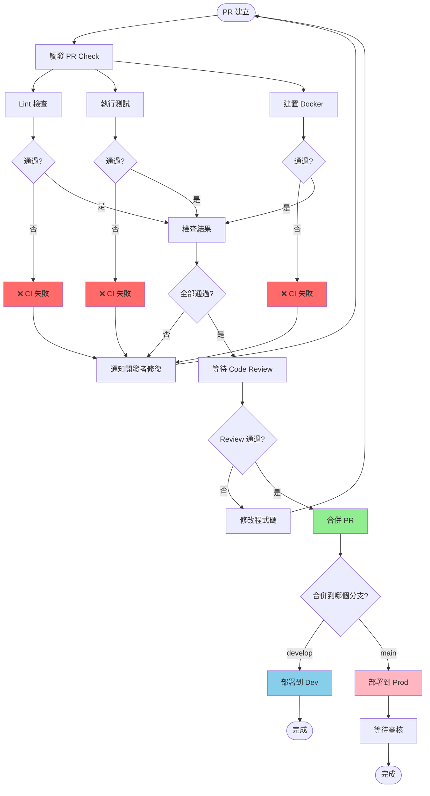

# Git Flow 視覺化圖表

## 完整開發流程

```mermaid
gitGraph
    commit id: "Initial"
    branch develop
    checkout develop
    commit id: "Setup dev"

    branch feature/add-api
    checkout feature/add-api
    commit id: "feat: add API endpoint"
    commit id: "feat: add validation"

    checkout develop
    merge feature/add-api tag: "PR merged to dev"
    commit id: "Auto deploy to Dev" type: HIGHLIGHT

    branch feature/add-ui
    checkout feature/add-ui
    commit id: "feat: add UI component"

    checkout develop
    merge feature/add-ui tag: "PR merged"
    commit id: "Deploy to Dev" type: HIGHLIGHT

    checkout main
    merge develop tag: "Release v1.1.0"
    commit id: "Deploy to Prod" type: HIGHLIGHT

    checkout main
    branch hotfix/critical-bug
    commit id: "fix: security patch"

    checkout main
    merge hotfix/critical-bug tag: "Hotfix deployed"
    commit id: "Emergency deploy" type: REVERSE

    checkout develop
    merge main tag: "Sync hotfix"
```

## 分支策略詳解

```mermaid
graph TB
    A[開始開發] --> B{新功能 or 修復?}

    B -->|新功能| C[從 develop 建立 feature/*]
    B -->|緊急修復| D[從 main 建立 hotfix/*]

    C --> E[本地開發與測試]
    E --> F[Push 到 GitHub]
    F --> G[建立 PR to develop]
    G --> H[PR Check CI]

    H --> I{CI 通過?}
    I -->|否| E
    I -->|是| J[Code Review]

    J --> K{Review 通過?}
    K -->|否| E
    K -->|是| L[合併到 develop]

    L --> M[自動部署到 Dev 環境]
    M --> N[Dev 環境測試]

    N --> O{測試通過?}
    O -->|否| P[建立 bugfix PR]
    O -->|是| Q[等待發布]

    P --> E

    Q --> R[建立 Release PR to main]
    R --> S[Release PR Check]
    S --> T[審核者批准]
    T --> U[合併到 main]
    U --> V[自動部署到 Prod 環境]

    D --> W[修復 bug]
    W --> X[建立 PR to main]
    X --> Y[緊急審核]
    Y --> Z[合併並部署]
    Z --> AA[同步回 develop]

    style M fill:#90EE90
    style V fill:#FFB6C1
    style Z fill:#FF6B6B
```

## CI/CD Pipeline 流程

```mermaid
sequenceDiagram
    participant Dev as 開發者
    participant GH as GitHub
    participant CI as GitHub Actions
    participant Reg as Artifact Registry
    participant DevEnv as Dev 環境
    participant ProdEnv as Prod 環境

    Note over Dev,GH: Feature 開發流程
    Dev->>GH: Push feature branch
    Dev->>GH: 建立 PR to develop

    activate CI
    GH->>CI: 觸發 PR Check
    CI->>CI: Lint 檢查
    CI->>CI: 執行測試
    CI->>CI: Build Docker image
    CI->>GH: 回報檢查結果
    deactivate CI

    GH->>Dev: 等待 Code Review
    Dev->>GH: Review & Approve
    GH->>GH: 合併 PR to develop

    activate CI
    GH->>CI: 觸發 Deploy to Dev
    CI->>CI: Build Docker image
    CI->>Reg: Push image (dev-latest)
    CI->>DevEnv: Deploy 到 Dev
    DevEnv-->>CI: 部署成功
    CI->>GH: 更新部署狀態
    deactivate CI

    Note over Dev,DevEnv: Dev 環境測試
    Dev->>DevEnv: 功能測試

    Note over Dev,ProdEnv: 發布到生產環境
    Dev->>GH: 建立 Release PR to main

    activate CI
    GH->>CI: 觸發 PR Check
    CI->>CI: 完整檢查
    CI->>GH: 回報結果
    deactivate CI

    GH->>Dev: 等待審核者批准
    Dev->>GH: Approve Release
    GH->>GH: 合併 PR to main

    activate CI
    GH->>CI: 觸發 Deploy to Prod
    CI->>CI: 需要審核批准
    Dev->>CI: 批准部署
    CI->>CI: Build Docker image
    CI->>Reg: Push image (prod-latest)
    CI->>ProdEnv: Deploy 到 Prod
    ProdEnv-->>CI: 部署成功
    CI->>GH: 更新部署狀態
    deactivate CI
```

## 環境與部署關係

```mermaid
graph LR
    subgraph "本地開發"
        L1["feature/* 分支"]
        L2["hotfix/* 分支"]
    end

    subgraph "GitHub Branches"
        D[develop 分支]
        M[main 分支]
    end

    subgraph "CI/CD"
        PR[PR Check]
        DevCI[Deploy Dev]
        ProdCI[Deploy Prod]
    end

    subgraph "Artifact Registry"
        DevImg["dev-latest<br/>dev-{sha}"]
        ProdImg["prod-latest<br/>prod-{sha}<br/>v{version}"]
    end

    subgraph "環境"
        DevEnv[Dev 環境<br/>自動部署]
        ProdEnv[Prod 環境<br/>需審核]
    end

    L1 -->|PR| PR
    L2 -->|PR| PR
    PR -->|merge| D
    D -->|觸發| DevCI

    DevCI -->|build & push| DevImg
    DevImg -->|deploy| DevEnv

    D -->|Release PR| M
    M -->|觸發| ProdCI
    ProdCI -->|build & push| ProdImg
    ProdImg -->|deploy| ProdEnv

    L2 -->|Hotfix PR| M

    style DevEnv fill:#90EE90
    style ProdEnv fill:#FFB6C1
    style PR fill:#87CEEB
```

## PR 檢查流程

```mermaid
flowchart TD
    Start([PR 建立]) --> Trigger[觸發 PR Check]

    Trigger --> Lint[Lint 檢查]
    Trigger --> Test[執行測試]
    Trigger --> Build[建置 Docker]

    Lint --> LintOK{通過?}
    Test --> TestOK{通過?}
    Build --> BuildOK{通過?}

    LintOK -->|否| Fail1["❌ CI 失敗"]
    TestOK -->|否| Fail2["❌ CI 失敗"]
    BuildOK -->|否| Fail3["❌ CI 失敗"]

    LintOK -->|是| Check
    TestOK -->|是| Check
    BuildOK -->|是| Check

    Check[檢查結果] --> AllPass{全部通過?}

    AllPass -->|否| Notify1[通知開發者修復]
    AllPass -->|是| Review[等待 Code Review]

    Notify1 --> Start

    Review --> ReviewOK{Review 通過?}
    ReviewOK -->|否| Notify2[修改程式碼]
    ReviewOK -->|是| Merge[合併 PR]

    Notify2 --> Start

    Merge --> DeployDecision{合併到哪個分支?}
    DeployDecision -->|develop| DeployDev[部署到 Dev]
    DeployDecision -->|main| DeployProd[部署到 Prod]

    DeployDev --> End1([完成])
    DeployProd --> Approval[等待審核]
    Approval --> End2([完成])

    Fail1 --> Notify1
    Fail2 --> Notify1
    Fail3 --> Notify1

    style Merge fill:#90EE90
    style DeployDev fill:#87CEEB
    style DeployProd fill:#FFB6C1
    style Fail1 fill:#FF6B6B
    style Fail2 fill:#FF6B6B
    style Fail3 fill:#FF6B6B
```
