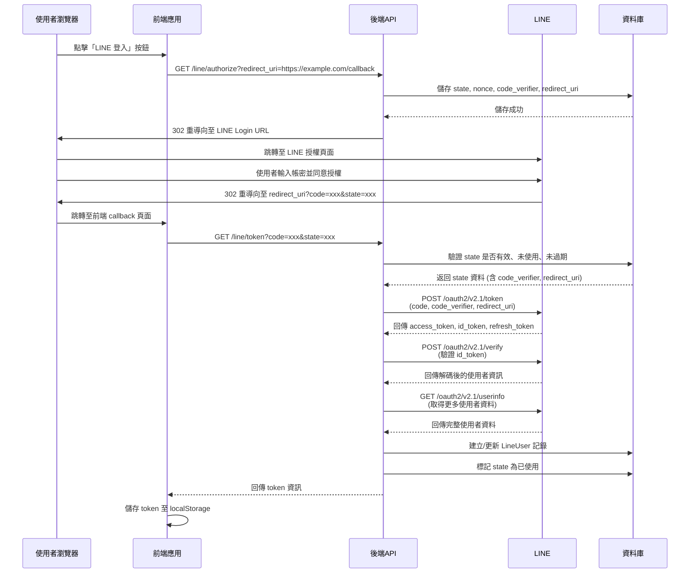

# LINE OAuth 2.0 整合文件

## 概述

本專案使用 LINE Login v2.1 實作 OAuth 2.0 / OpenID Connect (OIDC) 授權流程，支援 PKCE (Proof Key for Code Exchange) 以增強安全性。

## API 端點

### 1. 授權入口 (Authorization Endpoint)

**端點**: `GET /line/authorize`

**說明**: 產生 LINE Login 授權頁面 URL 並重導向，前端需提供回呼 URL。

**請求參數**:

| 參數 | 類型 | 必填 | 說明 |
|------|------|------|------|
| `redirect_uri` | string | 是 | LINE OAuth 回呼 URL，授權完成後 LINE 會將使用者導向此 URL |
| `prompt` | string | 否 | 控制授權畫面行為 (例如: `consent` 強制顯示同意畫面) |
| `response_mode` | string | 否 | 回應模式 (例如: `form_post`) |
| `disable_auto_login` | boolean | 否 | 是否停用自動登入功能 |

**回應**: 302 重導向至 LINE Login 授權頁面

**範例請求**:
```http
GET /line/authorize?redirect_uri=https://example.com/callback
```

**流程說明**:
1. 產生隨機的 `state`, `nonce`, `code_verifier`
2. 將 `state`, `nonce`, `code_verifier`, `redirect_uri` 儲存至資料庫 (有效期 10 分鐘)
3. 產生 LINE 授權 URL，包含以下參數:
   - `response_type`: `code`
   - `client_id`: LINE Channel ID
   - `redirect_uri`: 前端提供的回呼 URL
   - `state`: 防 CSRF 攻擊的隨機值
   - `scope`: `openid profile email`
   - `nonce`: 防重放攻擊
   - `code_challenge`: 由 `code_verifier` 計算而來 (SHA256)
   - `code_challenge_method`: `S256`
   - `ui_locales`: `zh-TW`

---

### 2. Token 交換端點 (Token Exchange Endpoint)

**端點**: `GET /line/token`

**說明**: 接收 LINE 授權碼並交換 access token、id token

**請求參數**:

| 參數 | 類型 | 必填 | 說明 |
|------|------|------|------|
| `code` | string | 是 | LINE 提供的授權碼 |
| `state` | string | 是 | 授權時產生的狀態值，用於驗證 |
| `error` | string | 否 | 授權失敗時的錯誤代碼 |
| `error_description` | string | 否 | 授權失敗時的錯誤說明 |

**回應**: `LineTokenResponse`

```json
{
  "access_token": "eyJhbGciOiJIUzI1NiIsInR5cCI6IkpXVCJ9...",
  "refresh_token": "eyJhbGciOiJIUzI1NiIsInR5cCI6IkpXVCJ9...",
  "id_token": "eyJhbGciOiJIUzI1NiIsInR5cCI6IkpXVCJ9...",
  "token_type": "Bearer",
  "expires_in": 2592000,
  "line_user_id": "U1234567890abcdef1234567890abcdef"
}
```

**流程說明**:
1. 驗證 `state` 是否有效且未使用、未過期
2. 使用 `code` 和 `code_verifier` 向 LINE Token API 交換 token
3. 使用儲存在資料庫中的 `redirect_uri` 進行 token 交換
4. 驗證 `id_token` 的 `nonce` 值
5. 取得使用者資訊 (LINE User ID, 姓名, 頭像, email)
6. 建立或更新資料庫中的使用者記錄
7. 回傳 token 資訊

---

### 3. 刷新 Token (Refresh Token Endpoint)

**端點**: `POST /line/refresh_token`

**說明**: 使用 refresh token 取得新的 access token

**請求參數** (form-data):

| 參數 | 類型 | 必填 | 說明 |
|------|------|------|------|
| `grant_type` | string | 是 | 固定值: `refresh_token` |
| `refresh_token` | string | 是 | 先前取得的 refresh token |

**回應**: `LineTokenResponse`

**範例請求**:
```http
POST /line/refresh_token
Content-Type: application/x-www-form-urlencoded

grant_type=refresh_token&refresh_token=eyJhbGciOiJIUzI1NiIsInR5cCI6IkpXVCJ9...
```

---

### 4. 撤銷 Token (Revoke Token Endpoint)

**端點**: `POST /line/revoke`

**說明**: 撤銷 access token

**請求參數** (form-data):

| 參數 | 類型 | 必填 | 說明 |
|------|------|------|------|
| `access_token` | string | 是 | 要撤銷的 access token |

**回應**:
```json
{
  "revoked": true
}
```

---

## 使用流程

### 完整授權流程



### 前端整合範例

```javascript
// 1. 啟動授權流程
const redirectUri = encodeURIComponent('https://example.com/callback');
window.location.href = `https://api.example.com/line/authorize?redirect_uri=${redirectUri}`;

// 2. 在 callback 頁面處理回應
const urlParams = new URLSearchParams(window.location.search);
const code = urlParams.get('code');
const state = urlParams.get('state');

// 3. 呼叫後端 token exchange API
const response = await fetch(`https://api.example.com/line/token?code=${code}&state=${state}`);
const tokenData = await response.json();

// 4. 儲存 token
localStorage.setItem('access_token', tokenData.access_token);
localStorage.setItem('refresh_token', tokenData.refresh_token);
```

---

## 資料模型

### LineSessionState (資料庫表: `line_session_states`)

| 欄位 | 類型 | 說明 |
|------|------|------|
| `id` | string (UUID) | 主鍵 |
| `state` | string | OAuth state 參數，用於防 CSRF |
| `nonce` | string | OIDC nonce 參數，用於防重放攻擊 |
| `code_verifier` | string | PKCE code verifier |
| `redirect_uri` | string | 前端提供的回呼 URL |
| `created_at` | datetime | 建立時間 |
| `consumed` | boolean | 是否已使用 (預設: false) |
| `expires_at` | datetime | 過期時間 (10 分鐘後) |

### LineUser (資料庫表: `line_users`)

| 欄位 | 類型 | 說明 |
|------|------|------|
| `id` | string (UUID) | 主鍵 |
| `line_user_id` | string | LINE User ID (唯一) |
| `display_name` | string | 顯示名稱 |
| `picture_url` | string | 頭像 URL |
| `email` | string | Email (需使用者授權) |
| `email_granted` | boolean | 是否授權 email |
| `scopes` | string | 授權範圍 |
| `access_token` | string | 存取權杖 |
| `refresh_token` | string | 更新權杖 |
| `id_token` | string | ID Token (OIDC) |
| `token_expires_at` | datetime | Token 過期時間 |
| `channel_id` | string | LINE Channel ID |
| `last_login_at` | datetime | 最後登入時間 |
| `created_at` | datetime | 建立時間 |
| `updated_at` | datetime | 更新時間 |

---

## 安全性

### PKCE (Proof Key for Code Exchange)

本實作使用 PKCE 來防止授權碼攔截攻擊：

1. 產生隨機 `code_verifier` (64 bytes, URL-safe base64)
2. 計算 `code_challenge = BASE64URL(SHA256(code_verifier))`
3. 授權請求時傳送 `code_challenge`
4. Token 交換時傳送原始 `code_verifier`
5. LINE 驗證 `SHA256(code_verifier)` 是否等於 `code_challenge`

### State 參數

- 每次授權請求產生唯一的隨機 `state`
- 防止 CSRF 攻擊
- `state` 在資料庫中僅能使用一次
- 有效期限 10 分鐘

**為什麼使用資料庫而不是 Session?**
- 本系統採用無狀態 (stateless) API 設計
- `LineSessionState` 資料表作為臨時儲存,儲存 OAuth 流程所需的參數
- 避免使用傳統的 server-side session,提升系統擴展性
- 前端完全控制 redirect_uri,支援多種前端應用 (Web, Mobile, Desktop)

### Nonce 參數

- 每次授權請求產生唯一的隨機 `nonce`
- 包含在 ID Token 中
- 防止 ID Token 重放攻擊

---

## 環境變數設定

### 必要環境變數

```bash
# LINE Channel 設定
LINE_CLIENT_ID=your_line_channel_id
LINE_CLIENT_SECRET=your_line_channel_secret

# 授權範圍 (可選，預設值如下)
LINE_SCOPES="profile openid email"
```

### 已棄用的環境變數

```bash
# ⚠️ DEPRECATED: redirect_uri 現在由前端在 /authorize 請求中提供
LINE_REDIRECT_URI=""
```

---

## 錯誤處理

### 常見錯誤

| 錯誤 | 說明 | 解決方法 |
|------|------|----------|
| `state 無效或已使用` | State 參數不存在或已被使用 | 重新啟動授權流程 |
| `state 已過期` | State 參數超過 10 分鐘 | 重新啟動授權流程 |
| `缺少 code 或 state` | 授權回呼參數不完整 | 檢查 LINE Channel 設定 |
| `nonce 驗證失敗` | ID Token 中的 nonce 不符 | 安全性問題，拒絕登入 |
| `交換 token 失敗` | 與 LINE API 溝通失敗 | 檢查網路連線和 Channel 設定 |
| `ID Token 驗證失敗` | ID Token 無效或過期 | 重新啟動授權流程 |

---

## 資料庫遷移

新增 `redirect_uri` 欄位至 `line_session_states` 表：

```sql
ALTER TABLE line_session_states ADD COLUMN redirect_uri VARCHAR;
```

使用 Alembic 進行遷移：

```bash
# 產生遷移腳本
alembic revision --autogenerate -m "Add redirect_uri to LineSessionState"

# 執行遷移
alembic upgrade head
```

---

## 測試

### 使用 curl 測試

```bash
# 1. 取得授權 URL (會重導向)
curl -L "http://localhost:8000/line/authorize?redirect_uri=http://localhost:3000/callback"

# 2. 使用者完成 LINE 授權後，使用回傳的 code 和 state
curl "http://localhost:8000/line/token?code=xxx&state=xxx"

# 3. 刷新 token
curl -X POST "http://localhost:8000/line/refresh_token" \
  -H "Content-Type: application/x-www-form-urlencoded" \
  -d "grant_type=refresh_token&refresh_token=xxx"

# 4. 撤銷 token
curl -X POST "http://localhost:8000/line/revoke" \
  -H "Content-Type: application/x-www-form-urlencoded" \
  -d "access_token=xxx"
```

---

## 參考資料

- [LINE Login v2.1 官方文件](https://developers.line.biz/en/docs/line-login/)
- [OAuth 2.0 RFC 6749](https://tools.ietf.org/html/rfc6749)
- [PKCE RFC 7636](https://tools.ietf.org/html/rfc7636)
- [OpenID Connect Core 1.0](https://openid.net/specs/openid-connect-core-1_0.html)
